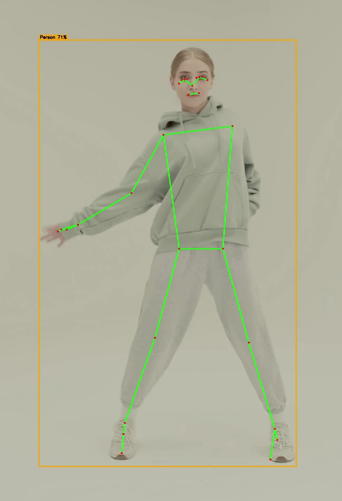
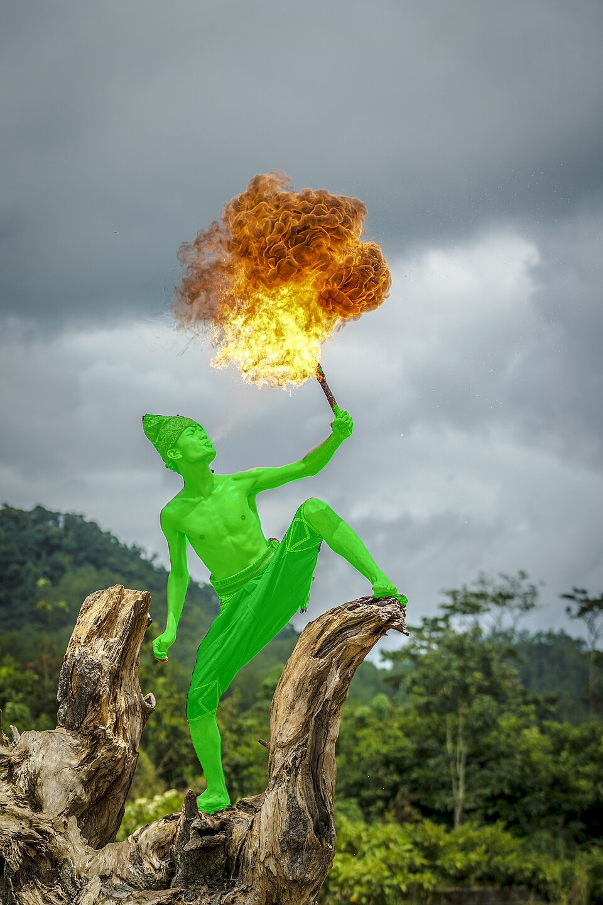
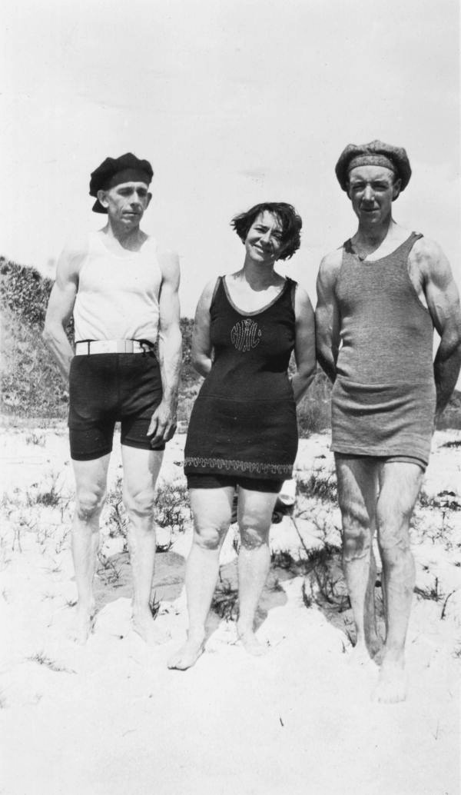
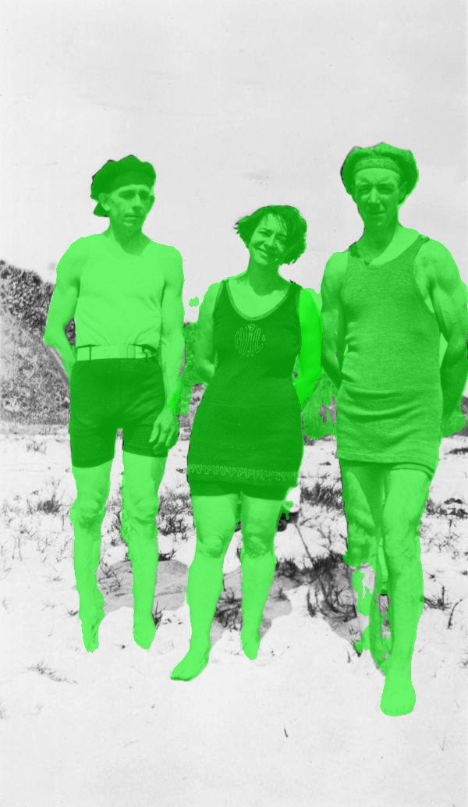

<h1 align="center">pose_detection</h1>
 
<p align="center">
<a href="https://flutter.dev"></a>
<a href="https://dart.dev"></a>
<br>
<a href="https://pub.dev/packages/pose_detection"></a>
<a href="https://pub.dev/packages/pose_detection/score"></a>
<a href="https://github.com/hugocornellier/pose_detection/actions/workflows/build.yml"></a>
<a href="https://github.com/hugocornellier/pose_detection/actions/workflows/integration.yml"></a>
<a href="https://github.com/hugocornellier/pose_detection/blob/main/LICENSE"></a>
</p>

Flutter plugin for on-device, multi-person pose detection and landmark estimation using TensorFlow Lite. Uses YOLOv8n for person detection and Google's [BlazePose](https://ai.google.dev/edge/mediapipe/solutions/vision/pose_landmarker) for 33-keypoint landmark extraction.

<p align="center">
  
  <br>
  <sub><i style="color: #888;">On-device pose detection and 33-point landmark tracking, rendered from <code>sample_videos/soccer_street.mp4</code>.</i></sub>
</p>

## Quick Start

```dart
import 'dart:io';
import 'dart:typed_data';
import 'package:pose_detection/pose_detection.dart';

Future main() async {
  // One-step construction and initialization
  final PoseDetector detector = await PoseDetector.create(
    mode: PoseMode.boxesAndLandmarks,
    landmarkModel: PoseLandmarkModel.heavy,
  );

  // Load and detect from image bytes
  final Uint8List imageBytes = await File('image.jpg').readAsBytes();
  final List<Pose> results = await detector.detect(imageBytes);

  // Access results
  for (final Pose pose in results) {
    final BoundingBox bbox = pose.boundingBox;
    print('Bounding box: (${bbox.left}, ${bbox.top}) → (${bbox.right}, ${bbox.bottom})');
    print('Size: ${bbox.width} x ${bbox.height}, center: (${bbox.center.x}, ${bbox.center.y})');

    if (pose.hasLandmarks) {
      // Iterate over landmarks
      for (final PoseLandmark lm in pose.landmarks) {
        print('${lm.type}: (${lm.x.toStringAsFixed(1)}, ${lm.y.toStringAsFixed(1)}) vis=${lm.visibility.toStringAsFixed(2)}');
      }

      // Access landmarks individually
      // See "Pose Landmark Types" section in README for full list of landmarks
      final PoseLandmark? leftKnee = pose.getLandmark(PoseLandmarkType.leftKnee);
      if (leftKnee != null) {
        print('Left knee visibility: ${leftKnee.visibility.toStringAsFixed(2)}');
      }
    }
  }

  // Clean up
  await detector.dispose();
}
```

Alternatively, construct and initialize separately if you need to configure between steps:

```dart
final PoseDetector detector = PoseDetector();
await detector.initialize(
  mode: PoseMode.boxesAndLandmarks,
  landmarkModel: PoseLandmarkModel.heavy,
);
```

Refer to the [sample code](https://pub.dev/packages/pose_detection/example) on the pub.dev example tab for a more in-depth example.

## Pose Detection Modes

This package supports two operation modes that determine what data is returned:

| Mode                            | Description                                 | Output                        |
| ------------------------------- | ------------------------------------------- | ----------------------------- |
| **boxesAndLandmarks** (default) | Full two-stage detection (YOLO + BlazePose) | Bounding boxes + 33 landmarks |
| **boxes**                       | Fast YOLO-only detection                    | Bounding boxes only           |

### Use boxes-only mode for faster detection

When you only need to detect where people are (without body landmarks), use `PoseMode.boxes` for better performance:

```dart
final PoseDetector detector = PoseDetector();
await detector.initialize(
  mode: PoseMode.boxes,  // Skip landmark detection
);

final List<Pose> results = await detector.detect(imageBytes);
for (final Pose pose in results) {
  print('Person detected at: ${pose.boundingBox}');
  print('Detection confidence: ${pose.score.toStringAsFixed(2)}');
  // pose.hasLandmarks will be false
}
```

## Bounding Boxes

The boundingBox property returns a BoundingBox object representing the pose bounding box in
absolute pixel coordinates. The BoundingBox provides convenient access to corner points,
dimensions (width and height), and the center point.

### Accessing Corners

```dart
final BoundingBox boundingBox = pose.boundingBox;

// Access individual corners by name (each is a Point with x and y)
final Point topLeft     = boundingBox.topLeft;       // Top-left corner
final Point topRight    = boundingBox.topRight;      // Top-right corner
final Point bottomRight = boundingBox.bottomRight;   // Bottom-right corner
final Point bottomLeft  = boundingBox.bottomLeft;    // Bottom-left corner

// Access coordinates
print('Top-left: (${topLeft.x}, ${topLeft.y})');
```

### Additional Bounding Box Parameters

```dart
final BoundingBox boundingBox = pose.boundingBox;

// Access dimensions and center
final double width  = boundingBox.width;     // Width in pixels
final double height = boundingBox.height;    // Height in pixels
final Point center = boundingBox.center;  // Center point

// Access coordinates
print('Size: ${width} x ${height}');
print('Center: (${center.x}, ${center.y})');

// Access all corners as a list (order: top-left, top-right, bottom-right, bottom-left)
final List<Point> allCorners = boundingBox.corners;
```

## Pose Landmark Models

Choose the model that fits your performance needs:

| Model | Speed | Accuracy |
|-------|-------|----------|
| **lite** | Fastest | Good |
| **full** | Balanced | Better |
| **heavy** | Slowest | Best |

## Pose Landmark Types

Every pose contains up to 33 landmarks that align with the BlazePose specification:

- nose
- leftEyeInner
- leftEye
- leftEyeOuter
- rightEyeInner
- rightEye
- rightEyeOuter
- leftEar
- rightEar
- mouthLeft
- mouthRight
- leftShoulder
- rightShoulder
- leftElbow
- rightElbow
- leftWrist
- rightWrist
- leftPinky
- rightPinky
- leftIndex
- rightIndex
- leftThumb
- rightThumb
- leftHip
- rightHip
- leftKnee
- rightKnee
- leftAnkle
- rightAnkle
- leftHeel
- rightHeel
- leftFootIndex
- rightFootIndex

```dart
// Example: how to access specific landmarks
// PoseLandmarkType can be any of the 33 landmarks listed above.
final PoseLandmark? leftHip = pose.getLandmark(PoseLandmarkType.leftHip);
if (leftHip != null && leftHip.visibility > 0.5) {
    // Pixel coordinates in original image space
    print('Left hip position: (${leftHip.x}, ${leftHip.y})');

    // Depth information (relative z-coordinate)
    print('Left hip depth: ${leftHip.z}');
}
```

### Drawing Skeleton Connections

The package provides `poseLandmarkConnections`, a predefined list of landmark pairs that form the body skeleton. Use this to draw skeleton overlays:

```dart
import 'package:flutter/material.dart';
import 'package:pose_detection/pose_detection.dart';

class PoseOverlayPainter extends CustomPainter {
  final Pose pose;

  PoseOverlayPainter(this.pose);

  @override
  void paint(Canvas canvas, Size size) {
    final Paint paint = Paint()
      ..color = Colors.green
      ..strokeWidth = 3
      ..strokeCap = StrokeCap.round;

    // Draw all skeleton connections
    for (final connection in poseLandmarkConnections) {
      final PoseLandmark? start = pose.getLandmark(connection[0]);
      final PoseLandmark? end = pose.getLandmark(connection[1]);

      // Only draw if both landmarks are visible
      if (start != null && end != null &&
          start.visibility > 0.5 && end.visibility > 0.5) {
        canvas.drawLine(
          Offset(start.x, start.y),
          Offset(end.x, end.y),
          paint,
        );
      }
    }

    // Draw landmark points
    for (final landmark in pose.landmarks) {
      if (landmark.visibility > 0.5) {
        canvas.drawCircle(
          Offset(landmark.x, landmark.y),
          5,
          Paint()..color = Colors.red,
        );
      }
    }
  }

  @override
  bool shouldRepaint(covariant CustomPainter oldDelegate) => true;
}
```

The `poseLandmarkConnections` constant contains 27 connections organized by body region:
- **Face**: Eyes to nose, eyes to ears, mouth
- **Torso**: Shoulders and hips forming the core
- **Arms**: Shoulders → elbows → wrists → fingers (left and right)
- **Legs**: Hips → knees → ankles → feet (left and right)

<p align="center">
  
</p>

### Built-in Overlay Painters

The package ships two ready-to-use `CustomPainter` implementations:

| Class | Use case |
|---|---|
| `MultiOverlayPainter` | Still images: scales detection coordinates to fit the widget |
| `CameraPoseOverlayPainter` | Live camera preview: handles coordinate mapping and optional front-camera horizontal mirroring |

```dart
// Still image overlay
CustomPaint(
  foregroundPainter: MultiOverlayPainter(results: poses),
  child: Image.memory(imageBytes),
)

// Live camera overlay (front camera, mirrored)
CustomPaint(
  foregroundPainter: CameraPoseOverlayPainter(
    poses: poses,
    cameraSize: Size(cameraWidth.toDouble(), cameraHeight.toDouble()),
    mirrorHorizontally: isFrontCamera,
  ),
  child: CameraPreview(controller),
)
```

## Segmentation Mask

<!--
  Before/after in two rows (dancer, then group). Each row pairs the SAME photo
  (identical aspect ratio), so both images take the same width and render at
  equal size, side by side on mobile and desktop. Size with percentage width=
  (NOT height=): pub.dev's stylesheet forces `img{height:auto}`, so a height=
  is discarded and the pair would wrap onto separate lines. 45% + 45% keeps them
  side by side at every width. Images live under assets/screenshots (pubignored)
  and render via pub.dev's relative-path rewrite to the repo.
-->
<p align="center">
  
  &nbsp;&nbsp;&nbsp;
  
</p>
<p align="center">
  
  &nbsp;&nbsp;&nbsp;
  
</p>
<p align="center">
  <sub><i style="color: #888;">Before / after: original photo (left) and on-device person segmentation (right), enabled with <code>enableSegmentation: true</code>. Each detected person gets their own mask. Photos via Wikimedia Commons (fire dancer by Myfirmann, CC BY-SA 4.0; group portrait, public domain); masks added.</i></sub>
</p>

Alongside the 33 landmarks, the BlazePose model also emits a coarse
person-vs-background segmentation mask. The model computes it on every landmark
inference regardless, so returning it adds no inference cost, only the mask
copy. It is opt-in and off by default.

Enable it at initialization with `enableSegmentation: true` (requires
`PoseMode.boxesAndLandmarks`):

```dart
final PoseDetector detector = await PoseDetector.create(
  mode: PoseMode.boxesAndLandmarks,
  enableSegmentation: true,
);

final List<Pose> poses = await detector.detect(imageBytes);
for (final Pose pose in poses) {
  final SegmentationMask? mask = pose.segmentationMask;
  if (mask != null) {
    // Person probability [0, 1] at an original-image pixel:
    final double p = mask.confidenceAt(pose.boundingBox.center.x, pose.boundingBox.center.y);
    print('center person probability: ${p.toStringAsFixed(2)}');
  }
}
```

Each detected person carries its own mask. The buffer is at model resolution
(`width` x `height`, 256x256) and covers the square image region described by
`imageLeft`, `imageTop`, `imageWidth`, and `imageHeight` (in original-image
pixels). `confidenceAt(x, y)` maps an original-image pixel to that buffer and
returns 0 outside the region.

### Rendering the mask

`toRgbaBytes()` expands the mask into a tinted RGBA buffer (alpha = person
probability) ready for `dart:ui`'s `decodeImageFromPixels`:

```dart
import 'dart:async';
import 'dart:ui' as ui;

Future<ui.Image> maskToImage(SegmentationMask mask) {
  final completer = Completer<ui.Image>();
  ui.decodeImageFromPixels(
    mask.toRgbaBytes(r: 0, g: 200, b: 255),
    mask.width,
    mask.height,
    ui.PixelFormat.rgba8888,
    completer.complete,
  );
  return completer.future;
}

// In a CustomPainter, blit it into the mask's image-space region:
canvas.drawImageRect(
  image,
  Rect.fromLTWH(0, 0, mask.width.toDouble(), mask.height.toDouble()),
  Rect.fromLTWH(mask.imageLeft, mask.imageTop, mask.imageWidth, mask.imageHeight),
  Paint()..color = const Color(0x80FFFFFF), // global opacity
);
```

**Notes and limitations:**

- **Coarse silhouette.** BlazePose's mask is a soft person outline, good for
  background blur or tinting, not a crisp cutout matte.
- **Per-person crop.** Each mask only covers that person's padded crop region,
  which may extend past the image edges.
- **Platform support.** Populated on native platforms (iOS, Android, macOS,
  Windows, Linux). On web the flag is accepted for API parity but
  `segmentationMask` stays `null`.
- **Requires landmarks.** Only produced under `PoseMode.boxesAndLandmarks` for
  poses that pass `minLandmarkScore`; it is always `null` in `PoseMode.boxes`.

## Live Camera Detection

For real-time pose detection from a camera feed, use `detectFromCameraImage`. All processing runs off the UI thread.

> **Desktop (Windows / macOS / Linux):** The default `camera` package does not include a streaming implementation for desktop platforms. You must also add [`camera_desktop`](https://pub.dev/packages/camera_desktop) to your `pubspec.yaml`, otherwise `startImageStream` throws `UnimplementedError: onStreamedFrameAvailable() is not implemented`.
> ```yaml
> dependencies:
>   camera: ^0.12.0
>   camera_desktop: ^1.2.0   # required for Windows, macOS, and Linux streaming
> ```

```dart
import 'package:camera/camera.dart';
import 'package:pose_detection/pose_detection.dart';

final detector = await PoseDetector.create(
  landmarkModel: PoseLandmarkModel.lite, // lite model for higher FPS
);

final cameras = await availableCameras();
final camera = CameraController(
  cameras.first,
  ResolutionPreset.medium,
  enableAudio: false,
  imageFormatGroup: ImageFormatGroup.yuv420, // prevents JPEG fallback on Android; ignored on desktop
);
await camera.initialize();

camera.startImageStream((CameraImage image) async {
  final poses = await detector.detectFromCameraImage(
    image,
    // rotation: rotationForFrame(...), // recommended on Android/iOS
    maxDim: 640,
  );
  // Process poses...
});
```

Tips:
- Pass `rotation:` on Android/iOS so the detector sees upright frames. Use `rotationForFrame(...)` to compute the correct value from sensor orientation and device orientation. On desktop frames are always upright so omit it.
- Pass `maxDim: 640` to downscale frames before inference. Recommended: full-res frames waste bandwidth since the model input is much smaller.
- Use `PoseLandmarkModel.lite` for fastest real-time performance.
- Mirror the overlay on the front camera to match `CameraPreview`'s auto-mirrored texture.
- For advanced use, `prepareCameraFrame(...)` + `detectFromCameraFrame(...)` is the lower-level two-step API.

See the full [example app](https://pub.dev/packages/pose_detection/example) for a complete implementation.

## Video Detection

In addition to still images and live camera feeds, `pose_detection` supports frame-by-frame inference on video files. The example app includes a fully working `VideoFileScreen` that shows the end-to-end flow:

1. **Open the video** with `cv.VideoCapture.fromFile(path)` (powered by [opencv_dart](https://pub.dev/packages/opencv_dart)).
2. **Read frames in a loop** with `cap.read()`, passing each `cv.Mat` directly to `detector.detectFromMat(frame)`.
3. **Draw results** onto the same `Mat` (bounding boxes + skeleton overlay).
4. **Write the annotated frame** to an output file with `cv.VideoWriter`, preserving the original FPS and resolution.
5. **Play back the result** in-app with the `video_player` package.

```dart
final cap = cv.VideoCapture.fromFile(path);
final fps = cap.get(cv.CAP_PROP_FPS);
final width = cap.get(cv.CAP_PROP_FRAME_WIDTH).toInt();
final height = cap.get(cv.CAP_PROP_FRAME_HEIGHT).toInt();

final writer = cv.VideoWriter.fromFile(outPath, 'avc1', fps, (width, height));

cv.Mat? frame;
while (true) {
  final (ok, mat) = cap.read(m: frame);
  frame = mat;
  if (!ok || frame.isEmpty) break;

  final List<Pose> poses = await detector.detectFromMat(frame);
  // draw poses on frame...
  writer.write(frame);
}

cap.release();
writer.release();
```

When the OS video backend has the `avc1` writer available, the output is an H.264 MP4 with the pose overlay baked in. See `VideoFileScreen` in the [example app](https://pub.dev/packages/pose_detection/example) for the full implementation including progress tracking, cancellation, temporal smoothing, and playback.

**Notes:**
- Video processing is CPU-bound and runs off the UI thread via the detector's isolate. The UI stays responsive.
- Use `PoseLandmarkModel.lite` or `PoseLandmarkModel.full` for a better speed/accuracy tradeoff when processing long videos.
- On Linux, GStreamer plugins are required to open MP4 files: `sudo apt install gstreamer1.0-libav gstreamer1.0-plugins-good gstreamer1.0-plugins-bad`.

## Background Processing

On native platforms, inference runs automatically in a background isolate: the UI thread is never blocked during detection or landmark extraction. On Flutter Web, inference runs asynchronously through the browser JavaScript/WebGPU/WASM runtime. No special configuration is needed; `PoseDetector` handles the platform-specific execution path internally.

## Advanced Usage

### Multi-person detection

The detector automatically handles multiple people in a single image:

```dart
final List<Pose> results = await detector.detect(imageBytes);
print('Detected ${results.length} people');

for (int i = 0; i < results.length; i++) {
  final Pose pose = results[i];
  print('Person ${i + 1}:');
  print('Bounding box: ${pose.boundingBox}');
  print('Confidence: ${pose.score.toStringAsFixed(2)}');
  print('Landmarks: ${pose.landmarks.length}');
}
```

**Interpreter Pool:** The detector maintains a pool of TensorFlow Lite interpreter instances for landmark extraction. Each interpreter adds ~10MB memory overhead.

```dart
final detector = PoseDetector();
await detector.initialize(
  interpreterPoolSize: 3,  // Number of interpreter instances
);
```

- **Default pool size**: 1
- When any hardware acceleration is active (auto, XNNPACK, or GPU), pool size is automatically forced to 1 to prevent thread contention

### Detect from a file path

`detectFromFilepath` reads the file and delegates to `detect`. Native-only (uses `dart:io`).

```dart
final List<Pose> poses = await detector.detectFromFilepath('/path/to/image.jpg');
```

### Detect from raw pixel bytes (zero-copy)

`detectFromMatBytes` accepts raw pixel data without constructing a `cv.Mat` first. Bytes are transferred to the background isolate via `TransferableTypedData` with no copy. Useful when you already have decoded pixel data from another source.

```dart
final List<Pose> poses = await detector.detectFromMatBytes(
  pixelBytes,          // Raw BGR pixel data
  width: imageWidth,
  height: imageHeight,
  matType: 16,         // CV_8UC3 (default)
);
```

## Web (Flutter Web)

This package supports Flutter Web using the same package import:

```dart
import 'package:pose_detection/pose_detection.dart';
```

Two web runtimes are available, selectable per `PoseDetector`:

1. **LiteRT.js with WebGPU delegate (default).** Google's official web runtime via `flutter_litert >= 2.5.2`. ~18x faster in real measurements (446 ms -> 25 ms / call on the heavy BlazePose model with mixed single/multi-person images). Auto-loaded from CDN on first use, no `web/index.html` changes required. Prefers WebGPU; falls back to WASM automatically on unsupported browsers.
2. **`tflite-js` (CPU/WASM, legacy).** Pass `useLiteRt: false` to opt into the previous default. No additional CDN scripts beyond those already loaded.

The main difference from native is how you load images:

- The Quick Start example above uses `dart:io` (`File(...)`), which is not available on web.
- On web, load an image as `Uint8List` (for example from a file picker, drag-and-drop, or network response) and call `detect(imageBytes)`.
- `detectFromMat(...)`, `detectFromMatBytes(...)`, `detectFromCameraFrame(...)`, `detectFromCameraImage(...)`, and `detectFromFilepath(...)` are unsupported on web and throw `UnsupportedError`. Use `detect(imageBytes)` instead.
- `interpreterPoolSize` and `performanceConfig` are accepted for API compatibility but are ignored on web.

```dart
final detector = await PoseDetector.create(
  mode: PoseMode.boxesAndLandmarks,
  landmarkModel: PoseLandmarkModel.heavy,
);

final List<Pose> poses = await detector.detect(imageBytes);

await detector.dispose();
```

### Web (LiteRT.js + WebGPU, default)

No extra configuration needed. LiteRT.js is the default runtime:

```dart
final detector = await PoseDetector.create(
  mode: PoseMode.boxesAndLandmarks,
  landmarkModel: PoseLandmarkModel.heavy,
  // liteRtAccelerator defaults to 'auto': prefers WebGPU, falls back to WASM.
);
```

`liteRtAccelerator` accepts:

| Value | Behavior |
|---|---|
| `'auto'` (default) | Try WebGPU; if compile fails (no `navigator.gpu`, or unsupported ops) fall back to WASM. |
| `'webgpu'` | Request WebGPU; falls back to WASM if WebGPU compile fails. |
| `'wasm'` | Use SIMD-optimized WASM. Use this to opt out of GPU even when available. |

The WASM fallback is still substantially faster than the legacy `tflite-js` path because LiteRT.js's WASM is SIMD-optimized.

To opt into the legacy tflite-js path, pass `useLiteRt: false`.

If you need to self-host the runtime (offline, strict CSP, or to pin a specific build), call `flutter_litert`'s `configureLiteRtLoader(moduleUrl: ..., wasmUrl: ...)` before any `PoseDetector.create`, or set `autoLoad: false` and load it from your own `<script>` tag instead.

### Benchmarks

Heavy BlazePose model on macOS Chrome 147, 5 images, 10 timed iterations each, averaged over 2 runs (see `runWebBenchmark.sh`):

| Image | Detections | Legacy tflite-js | LiteRT.js webgpu | Speedup |
|---|---|---|---|---|
| pose1 | 1 | 357 ms | 20 ms | 17.8× |
| pose2 | 1 | 357 ms | 18 ms | 19.9× |
| pose3 | 2 | 430 ms | 23 ms | 18.7× |
| pose4 | 6 | 726 ms | 46 ms | 15.9× |
| pose5 | 1 | 360 ms | 17 ms | 20.7× |
| **mean** | | **446 ms** | **25 ms** | **~18×** |

Detection counts are identical between the two runtimes on every image.

### Separate `example_web` app

The repository keeps the browser demo in `example_web/` (separate from `example/`) because the web sample uses browser-specific APIs (HTML file picker + canvas overlay) and UI flow. The demo uses the default `'auto'` accelerator (WebGPU with WASM fallback). Copy from <a href="https://github.com/hugocornellier/pose_detection/blob/main/example_web/lib/main.dart" target="_blank">example_web/lib/main.dart</a> as a starting point.

Run the web demo locally:

```bash
cd example_web
flutter pub get
flutter run -d chrome
```

Build for web:

```bash
cd example_web
flutter build web
```

## Performance

### Hardware Acceleration

`PoseDetector` runs on one of two inference engines, selected at init:

- **Interpreter** (default). Classic TFLite. CPU via XNNPACK on every platform. GPU only via the platform delegates below, which are deprecated and platform-limited.
- **CompiledModel** (opt-in: `useCompiledModel: true`). LiteRT Next. Auto-selects GPU/NPU with automatic CPU fallback on every platform, and it is faster on CPU too (parity-checked: roughly 1.4x to 3.5x vs the plain Interpreter, at or above XNNPACK on most models).

| Platform | Interpreter GPU (default engine) | CompiledModel GPU (`useCompiledModel: true`) |
|----------|:---:|:---:|
| Android | ✅ `GpuDelegateV2`* | ✅ |
| iOS / macOS | ✅ Metal* | ✅ |
| **Windows / Linux** | ❌ CPU only (XNNPACK) | ✅ |
| Web | WebGPU via `liteRtAccelerator` | (n/a) |

> \*Interpreter GPU/Metal delegates are deprecated (removed in flutter_litert 4.0.0). **On Windows and Linux, GPU is available only through CompiledModel**, because the Interpreter has no desktop GPU delegate.

```dart
// Default (Interpreter): CPU everywhere; GPU on Android and Apple only.
final detector = await PoseDetector.create();

// CompiledModel: GPU/NPU where available, automatic CPU fallback.
// This is the only GPU path on Windows and Linux.
final detector = await PoseDetector.create(useCompiledModel: true);
```

### Accelerator selection (CompiledModel)

When `useCompiledModel: true`, two optional parameters control the LiteRT Next backend. They have no effect on the default Interpreter engine.

- `accelerators` (`Set<Accelerator>`, default `{Accelerator.gpu, Accelerator.cpu}`). The accelerators the backend may use. The runtime picks the fastest available and falls back through the set. If none initialize it throws, so include `Accelerator.cpu` to guarantee a fallback. The default requests GPU with CPU fallback.
- `precision` (`Precision`, default `Precision.fp16`). Numeric precision for the compiled graph. `Precision.fp32` trades speed for accuracy.

```dart
// CPU only, using CompiledModel's fast CPU runtime.
await PoseDetector.create(
  useCompiledModel: true,
  accelerators: {Accelerator.cpu},
);

// GPU only. Throws if the GPU backend cannot initialize.
await PoseDetector.create(
  useCompiledModel: true,
  accelerators: {Accelerator.gpu},
);

// NPU first, CPU fallback, at fp32 precision.
await PoseDetector.create(
  useCompiledModel: true,
  accelerators: {Accelerator.npu, Accelerator.cpu},
  precision: Precision.fp32,
);
```

`Accelerator` and `Precision` are exported from the package.

### Advanced Performance Configuration

`performanceConfig` tunes the **Interpreter** engine only. It has no effect when `useCompiledModel: true`.

```dart
// Auto mode (default), optimal for each platform
final detector = await PoseDetector.create();

// Force XNNPACK (all native platforms)
final detector = await PoseDetector.create(
  performanceConfig: PerformanceConfig.xnnpack(numThreads: 4),
);

// Force the Interpreter GPU delegate (Android and Apple only; deprecated, prefer CompiledModel)
final detector = await PoseDetector.create(
  performanceConfig: PerformanceConfig.gpu(),
);

// CPU-only (maximum compatibility)
final detector = await PoseDetector.create(
  performanceConfig: PerformanceConfig.disabled,
);
```
## Migration Guide

### 3.0.0 breaking changes

#### Configuration moved from constructor to `initialize()`

Configuration parameters are no longer accepted by `PoseDetector(...)`. Use the no-argument constructor plus `initialize(...)`, or keep using `PoseDetector.create(...)` for one-step construction.

```dart
// Before (2.x)
final detector = PoseDetector(
  mode: PoseMode.boxesAndLandmarks,
  landmarkModel: PoseLandmarkModel.heavy,
);

// After (3.0)
final detector = PoseDetector();
await detector.initialize(
  mode: PoseMode.boxesAndLandmarks,
  landmarkModel: PoseLandmarkModel.heavy,
);

// Or one step
final detector = await PoseDetector.create(
  mode: PoseMode.boxesAndLandmarks,
  landmarkModel: PoseLandmarkModel.heavy,
);
```

#### `detectFromMat` signature changed

The `imageWidth` and `imageHeight` named arguments have been removed. Dimensions are now read directly from the Mat.

```dart
// Before (2.x)
final poses = await detector.detectFromMat(
  mat,
  imageWidth: mat.cols,
  imageHeight: mat.rows,
);

// After (3.0)
final poses = await detector.detectFromMat(mat);
```

#### Native `detect(...)` decode failures now throw

On native platforms, undecodable image bytes now throw `FormatException` instead of returning an empty list. Wrap `detect(...)` in a `try/catch` if your 2.x call site depended on silent failure. On web, decode failure still returns an empty list because browser image decode failure does not throw through this API.

```dart
try {
  final poses = await detector.detect(imageBytes);
  // Process poses...
} on FormatException {
  // Handle invalid or unsupported image bytes.
}
```

### Platform note: repeated `initialize()` calls

Native detectors throw `StateError` if `initialize()` is called twice without `dispose()`. The web detector disposes existing models and reinitializes.
